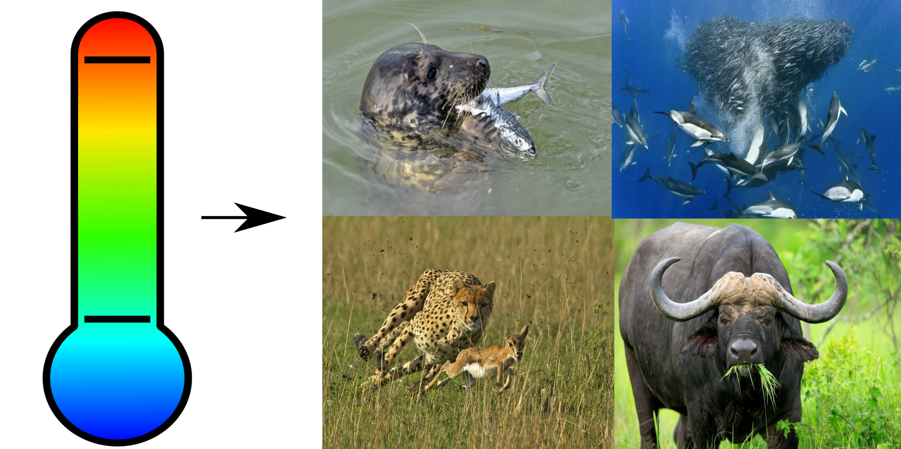

---
output:
  xaringan::moon_reader:
  #  self_contained: TRUE
    includes:
      in_header: conf/style-header.html
    lib_dir: assets
    seal: false
    css: ["default", "conf/css/style.css", "conf/css/fonts.css"]
    nature:
      beforeInit: "conf/style-macros.js"
      slideNumberFormat: | # to add a progress bar
        <div class="progress-bar-container">
          <div class="progress-bar" style="width: calc(%current% / %total% * 100%);">
          </div>
        </div>
---

```{r setup, echo = F}
knitr::opts_chunk$set(
  comment = "#",
  #cache = TRUE,
  collapse = TRUE,
  warning = FALSE,
  message = FALSE,
  fig.width = 7,
  fig.height = 5.25,
  fig.align = 'center'
)

mypar = list(mar = c(3,3,0.5,0.5), mgp = c(1.5, 0.3, 0), tck = -.008)
```
class: middle, title-slide

# Temperature effects on biomass distribution and trophic cascade in food chains

## blabla

### Azenor Bideault, .tiny[PhD candidate <br> + add co-authors]

<br><br>
<i class="fa fa-github fa-2x" style="color:#335049"></i> [Azenor/Talk_CSBQ2019](https://github.com/Azenor/Talk_CSBQ2019)

<i class="fa fa-twitter fa-2x" style="color:#335049"></i> [@Azenor_Bideault](https://twitter.com/Azenor_Bideault)

---
class: inverse, center, middle

# Temperature effects

## from individuals to communities

---

## Trophic interaction

<br><br><br>


---
class: inverse

.pull-left1[
<br>

# Key message here

<br><br><br><br><br><br><br><br>

**Special thanks to**

Nice people
]

.pull-right1[
<br>
<br>

]
