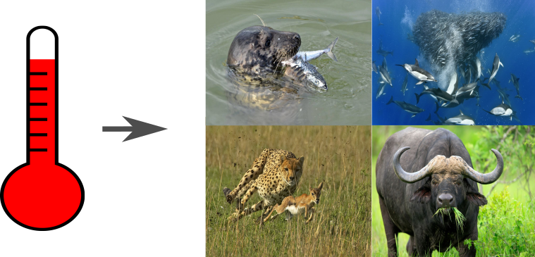

---
output:
  xaringan::moon_reader:
  #  self_contained: TRUE
    includes:
      in_header: conf/style-header.html
    lib_dir: assets
    seal: false
    css: ["default", "conf/css/style.css", "conf/css/fonts.css"]
    nature:
      beforeInit: "conf/style-macros.js"
      slideNumberFormat: | # to add a progress bar
        <div class="progress-bar-container">
          <div class="progress-bar" style="width: calc(%current% / %total% * 100%);">
          </div>
        </div>
---

```{r setup, echo = F}
knitr::opts_chunk$set(
  comment = "#",
  #cache = TRUE,
  collapse = TRUE,
  warning = FALSE,
  message = FALSE,
  fig.width = 7,
  fig.height = 5.25,
  fig.align = 'center'
)

mypar = list(mar = c(3,3,0.5,0.5), mgp = c(1.5, 0.3, 0), tck = -.008)
```
class: middle, title-slide

# Temperature effects on biomass distribution and trophic control in consumer-resource systems

## A cross-ecosystem comparison

### Azenor Bideault, .tiny[PhD candidate <br> Nuria Galiana, Matthieu Barbier, Yuval Zelnik, Michel Loreau, Dominique Gravel, Arnaud Sentis]

<br><br>
<i class="fa fa-github fa-2x" style="color:#335049"></i> [Azenor/Talk_CSBQ2019](https://github.com/Azenor/Talk_CSBQ2019)

<i class="fa fa-twitter fa-2x" style="color:#335049"></i> [@Azenor_Bideault](https://twitter.com/Azenor_Bideault)

---

## Trophic interactions under warming

<br><br><br>


<br><br>
.center[**Structure and dynamics of communities**]

---

## Food chain structural properties
### Biomass distribution


---

## Food chain structural properties
### Biomass distribution


---
## Food chain dynamical features
### Trophic control


---
## Food chain dynamical features
### Trophic control


---

## Food chain structure and dynamic
### Trophic cascade

<br><br>


.center[Sea otters indirectly enhance kelps abundance by consuming herbivorous sea urchins]

.small[.pull-right2[*Estes et al 2011*]]

---
class: inverse, center, middle

# What about temperature?
## Effects at different organization levels
---

## Temperature effects at the community level
### Biomass distribution


---

## Temperature effects at the community level
### Trophic control


---

## Temperature effects at the individual levels
### Biological rates


.center[There is variability in thermal sensitivities across biological rates and species]

---

## Temperature effects
### From the individuals to the community


---
## Lack of consensus
### No mechanistic understanding

<br>
.pull-left[]

.pull-right[
- One particular ecological system
- One process at a time
- Different experimental design
- Different model assumptions

<br><br>
]
---
class: inverse, center, middle

# What are the effects of temperature on biomass structure and trophic control in consumer-resource interactions?
## Toward a mechanistic understanding

---
## Theoretical framework
### Synthetic parameters describing food chain properties

<br>


<br><br>
.small[.pull-right2[*Barbier & Loreau 2019*]]

---
## Theoretical framework
### Synthetic parameters describing food chain properties

<br>


<br><br>
.small[.pull-right2[*Barbier & Loreau 2019*]]

---
## Theoretical framework
### Temperature dependence

<br>


---
## Theoretical framework
### Temperature dependence

<br>


---
## Theoretical framework
### Temperature dependence of biological rates

.pull-left[.center[]]

.pull-right[
<br><br>

$\huge b_i = b_0e^{-E/kT}$

<br><br><br>

* b<sub>0</sub>, k constants
* T temperature
* **E activation energy**
]

<br><br><br>
.center[The activation energy defines the rate's thermal sensitivity]

---
## Theoretical framework
### Temperature dependence of the synthetic parameters

.pull-left[
<br><br>
Synthetic parameters :
<br><br>
$\Large κ = \dfrac{ϵD_1}{D_2}$
<br><br><br><br><br>
$\Large λ = \dfrac{ϵA_{21}}{D_1D_2}$
]

.pull-right[
<br><br>
Their activation energies :
<br><br>
$\large E_κ = E_ϵ + 2E_{A-D_2} + E_{ΔD}$
<br><br>
$\large E_\lambda = E_ϵ - E_{ΔD}$

.center[]]

---
## Database of activation energies
### for different taxonomic groups and habitats


.pull-left[
* Various species (ectotherm)
* Taxonomic groups
* Habitat
* Diet
]
<br><br><br><br>
.small[.pull-right2[*Dell et al 2011, Burnside et al 2014, Fussman et al 2014*]]

---
## Effects of temperature on biomass structure and trophic control in consumer-resource interactions

<br><br>
* Temperature dependence of λ and κ
  - Aquatic vs terrestrial organisms
  - Across taxonomic groups
* Shift in λ and κ for herbivores-primary producers at the global scale

---
class: inverse, center, middle

# Results

---
## Thermal dependence of λ and κ

<br><br>
.center[]

---
## Thermal dependence of λ and κ

<br><br>
.center[]

---
## Thermal dependence of λ and κ
### Across taxonomic groups

<br><br>
.center[]

---
## Thermal dependence of λ and κ
### Across taxonomic groups

<br><br>
.center[]

.pull-right1[**Mismatches between biological rates**]

---
## Thermal dependence of λ and κ
### Across taxonomic groups

<br><br>
.center[]

.pull-right[
$\large E_\lambda = E_ϵ - E_{ΔD}$]

---
## Herbivory at the global scale

<br>
.center[]

.small[.pull-right2[*Bar-on et al 2018*]]

---
## Herbivory at the global scale

<br>
.center[]

.small[.pull-right2[*Bar-on et al 2018*]]

---
class: inverse, center, middle

# To conclude

---
## To conclude

.center[]

---
## To conclude

.center[]
<br>
.center[**3 fundamental biological rates and their mismatches**]

---
## To conclude

.center[]
<br>
.center[**General trend : more top-down control in aquatic systems and top-heavier biomass distribution in terrestrial and aquatic ones**]
---
## To conclude

.center[]
<br>
.center[**Herbivory : more top-down control and less bottom-heavy biomass distribution**]
---
## To conclude

.pull-left[
- Mechanistic understanding
- Differences between aquatic and terrestrial communities
- Predictions
- Variation between taxonomic groups

<br>
]

---
## To conclude

.pull-left[
- Mechanistic understanding
- Differences between aquatic and terrestrial communities
- Predictions
- Variation between taxonomic groups

<br><br>
]

.pull-right[
But...
- Lack of data
  - Self-regulation
  - Biomass conversion efficiency
  - Full thermal response
- Consumer-resource interactions

<br><br><br>
.center[**Explore and better understand community functioning under warming**]
]
---
class: inverse

.pull-left1[
<br>

# Temperature induces changes in community structure and dynamic

<br><br>

**Special thanks to**

- You
- My co-authors (for the great working group!)
- My lab mates in Sherbrooke and Moulis
- Willian Vieira (for the nice template)]

.pull-right1[
<br><br>

]
