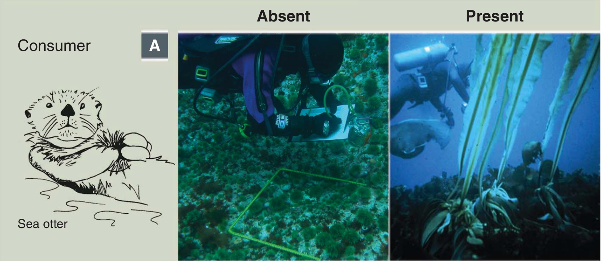

---
output:
  xaringan::moon_reader:
  #  self_contained: TRUE
    includes:
      in_header: conf/style-header.html
    lib_dir: assets
    seal: false
    css: ["default", "conf/css/style.css", "conf/css/fonts.css"]
    nature:
      beforeInit: "conf/style-macros.js"
      slideNumberFormat: | # to add a progress bar
        <div class="progress-bar-container">
          <div class="progress-bar" style="width: calc(%current% / %total% * 100%);">
          </div>
        </div>
---

```{r setup, echo = F}
knitr::opts_chunk$set(
  comment = "#",
  #cache = TRUE,
  collapse = TRUE,
  warning = FALSE,
  message = FALSE,
  fig.width = 7,
  fig.height = 5.25,
  fig.align = 'center'
)

mypar = list(mar = c(3,3,0.5,0.5), mgp = c(1.5, 0.3, 0), tck = -.008)
```
class: middle, title-slide

# Temperature effects on biomass distribution and trophic control in food chains

## A cross-ecosystem comparison

### Azenor Bideault, .tiny[PhD candidate <br> + add co-authors]

<br><br>
<i class="fa fa-github fa-2x" style="color:#335049"></i> [Azenor/Talk_CSBQ2019](https://github.com/Azenor/Talk_CSBQ2019)

<i class="fa fa-twitter fa-2x" style="color:#335049"></i> [@Azenor_Bideault](https://twitter.com/Azenor_Bideault)

---
class: inverse, center, middle

# Species interaction under warming

## Structure and dynamic of communities

---

## Trophic interaction

<br><br><br>


<br><br>
.center[Food chain structural properties and dynamical features]

---

## Food chain structural properties
### Biomass distribution


<!--
Expliquer biomass distribution (parallèle avec pyramide de Keops, richesse, nombre de femmes en académique)
Donner des exemples d'écosystèmes bottom-heavy and top-heavy
de hoekman2010 :
Bottom-up
regulation occurs through resource availability at the
base of the food web, such that increased productivity at
lower trophic levels results in increased productivity at
higher trophic levels (Elton 1927). Top-down regulation
occurs through predator populations limiting prey
populations, such that the addition of more predators
reduces the biomass of their prey (Oksanen et al. 1981).
Exemple de trophic cascade + importance, conséquences sur l'écosystèmes :
Estes et al + Frank et al 2007 -->

---

## Food chain structural properties
### Biomass distribution


---
## Food chain dynamical features
### Trophic control


---
## Food chain dynamical features
### Trophic control


---

## Food chain structure and dynamic
### Trophic cascade

<br><br>


.center[Sea otters indirectly enhance kelps abundance by consuming herbivorous sea urchins]

.small[.pull-right2[*Estes et al 2011*]]

---
class: inverse, center, middle

# What about temperature?
## Effects at different organization levels
---

## Temperature effects at the community level
### Biomass distribution


---

## Temperature effects at the community level
### Trophic control


---

## Temperature effects at the individual levels
### Biological rates


.center[There is variability in thermal sensitivities across biological rates and species]

---

## Temperature effects
### From the individuals to the community


---
## No consensus
### Both empirical and theoretical studies reach very divergent outcomes

<br>
.pull-left[]

.pull-right[.center[

**Hard to draw a general picture on the effects of temperature on consumer-resource interactions**]]

---
## No consensus
### between and among experiments and theory

.pull-left[Experimental studies
- One particular ecological system
- Experimental design
- One process at a time

<br><br>
]

.pull-right[Theoretical studies
- Different model assumptions
- One process at a time


<br><br>
]

---
class: inverse, center, middle

# What are the effects of temperature on biomass structure and trophic control in consumer-resource interactions?

---
## Theoretical framework
### Synthetic parameters describing food chain properties

<br>


<br><br>
.small[.pull-right2[*Barbier & Loreau 2019*]]

---
## Theoretical framework
### Synthetic parameters describing food chain properties

<br>


<br><br>
.small[.pull-right2[*Barbier & Loreau 2019*]]

---
## Theoretical framework
### Temperature dependence

<br>


---
## Theoretical framework
### Temperature dependence

<br>


---
## Theoretical framework
### Temperature dependence of the biological rates

.pull-left[.center[]]

.pull-right[
<br><br>

$\huge b_i = b_0e^{-E/kT}$

<br><br><br>

* b<sub>0</sub>, k constants
* T temperature
* **E activation energy**
]

<br><br><br>
.center[The activation energy defines the rate's thermal sensitivity]

---
## Theoretical framework
### Temperature dependence of the synthetic parameters

.pull-left[
<br><br>
Synthetic parameters :
<br><br>
$\Large κ = \dfrac{ϵD_1}{D_2}$
<br><br><br><br><br>
$\Large λ = \dfrac{ϵA_{21}}{D_1D_2}$
]

.pull-right[
<br><br>
Their activation energies :
<br><br>
$\large E_κ = E_ϵ + 2E_{A-D_2} + E_{ΔD}$
<br><br>
$\large E_\lambda = E_ϵ - E_{ΔD}$

.center[]]


---
## Database of activation energies
### for different taxonomic groups/habitats


.small[.pull-right[*Dell et al 2011, Burnside et al 2014, Fussman et al 2014*]]

---
class: inverse

.pull-left1[
<br>

# Key message here

<br><br><br><br><br><br><br><br>

**Special thanks to**

Nice people
]

.pull-right1[
<br>
<br>

]
